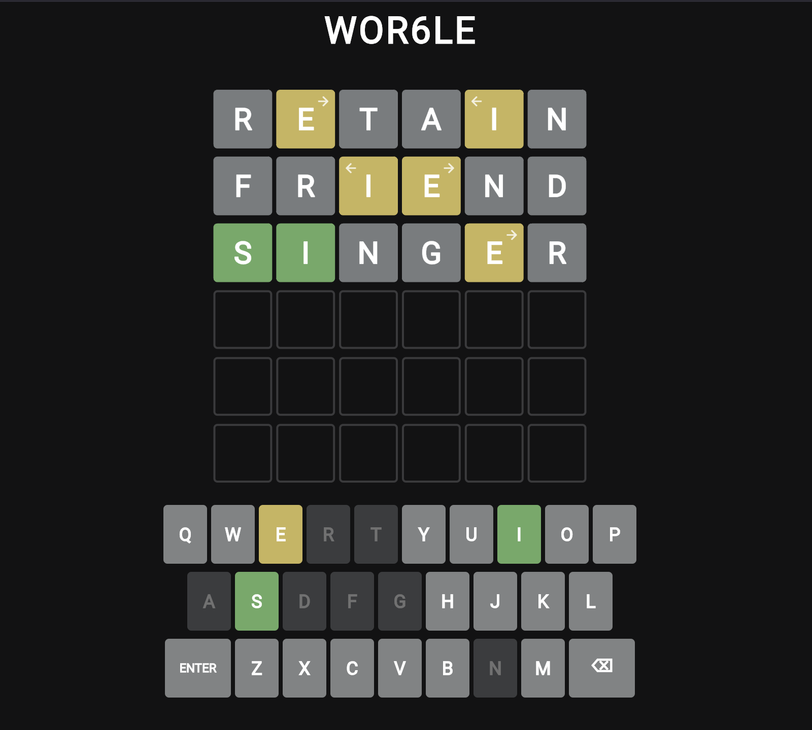

# WOR6LE

A Flutter implementation of the popular word game Wordle with two updates:
1. Use **6 letters** instead of 5.
2. For letters found in other positions in the word, add **Directional arrows** (**←** or **→**) which point towards where those letters are.



## Inspiration

I play the regular [Wordle](https://www.nytimes.com/games/wordle) super often, but found myself having a couple of things happen:

- I'd keep coming up with 6 letter words instead of the usual 5 in the regular Wordle game.
- I'd get lots of yellow letters but sometimes draw a complete blank on what the word could be.

## How to Play

WOR6LE is a word guessing game about guessing the correct 6-letter word.

Use your keyboard or click or tap the on-screen keys to enter letters, then <kbd>enter</kbd> to submit your guess.

After your guess, color feedback will be provided for each letter:

| Color | What it means |
|-------|---------|
| 🟩 **Green** | Letter is correct and in the right spot |
| 🟨 **Yellow** | Letter is in the word but wrong spot (arrow shows direction) |
| ⬜ **Gray** | Letter is not in the word |

> The colors provide clues to help you narrow down the possibilities for the correct word.

### Examples

🟩 W&nbsp;&nbsp;&nbsp;
A&nbsp;&nbsp;&nbsp;
L&nbsp;&nbsp;&nbsp;
N&nbsp;&nbsp;&nbsp;
U&nbsp;&nbsp;&nbsp;
T&nbsp;&nbsp;&nbsp;

W is in the word and in the correct spot.

---

I&nbsp;&nbsp;&nbsp;
N&nbsp;&nbsp;&nbsp;
🟨 D ←&nbsp;&nbsp;&nbsp;
I&nbsp;&nbsp;&nbsp;
G&nbsp;&nbsp;&nbsp;
O&nbsp;&nbsp;&nbsp;

D is in the word but in the wrong spot. The arrow ← shows it belongs to the left.

---

A&nbsp;&nbsp;&nbsp;
R&nbsp;&nbsp;&nbsp;
G&nbsp;&nbsp;&nbsp;
U&nbsp;&nbsp;&nbsp;
E&nbsp;&nbsp;&nbsp;
S&nbsp;&nbsp;&nbsp;

U is not in the word in any spot.

---

F&nbsp;&nbsp;&nbsp;
I&nbsp;&nbsp;&nbsp;
🟩 L →&nbsp;&nbsp;&nbsp;
T&nbsp;&nbsp;&nbsp;
E&nbsp;&nbsp;&nbsp;
R&nbsp;&nbsp;&nbsp;

L is correct, but appears twice. The arrow → points to the other L.

## Setting up the project

### Prerequisites
- Flutter SDK (3.9.2 or higher)
- Dart SDK (included with Flutter)

### Installation
```bash
# Clone the repository
git clone <repository-url>
cd wor6le

# Install dependencies
flutter pub get

# Run the app
flutter run

# alternatively, if you want to test the web version on a mobile device, supply a port and serve on the all-network-interfaces address like so:
# flutter run -d web-server --web-port=8080 --web-hostname=0.0.0.0
# # Then open your phone's browser and navigate to http://<your-computer-private-ip>:8080
```

### Available Platforms

Here's the list of platforms I've tested this on so far.

- ✅ Web
- ✅ macOS

## Acknowledgments

- Inspiration from the original [Wordle](https://www.nytimes.com/games/wordle/index.html).
- Word list taken from [dwyl/english-words](https://github.com/dwyl/english-words)

## Disclaimer

*Note: This project is not affiliated with or endorsed by The New York Times or Wordle. ‘Wordle’ is a registered trademark of The New York Times.*
